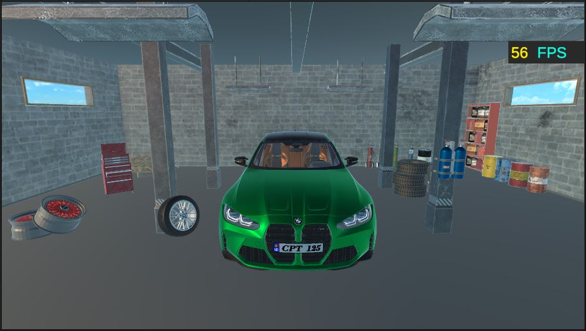
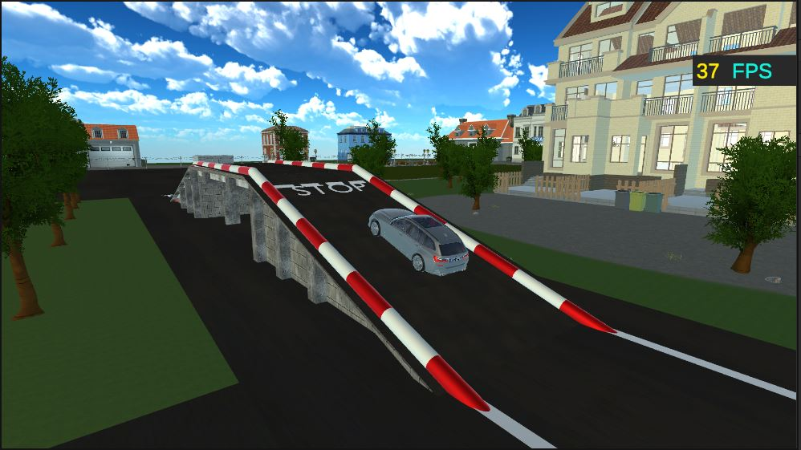

# Ciobanu_Nicolae_Aplicație_Practică_Informatică_Licență

# Simulator Scoala Auto realizat în Unity

Pașii pentru a transforma jocul din Unity într-un joc executabil
1. Se deschide proiectul din Unity.

2. Se accesează fila "Build Settings" în bara de meniu din Unity.

3. În fereastra "Build Settings", se selectează platforma dorită (Windows, Linux, MacOS) și se face clic pe butonul "Switch Platform" pentru a seta platforma de construire corespunzătoare.

4. După ce platforma a fost setată, se face clic pe butonul "Build".

5. Se alege un folder de destinație în care să se salveze fișierul executabil (Simulator Scoala Auto.exe).

6. Unity va începe procesul de construire și va genera fișierele necesare pentru aplicația executabilă.

7. După finalizarea procesului de construire, veți găsi fișierul executabil (Simulator Scoala Auto.exe) în folderul de destinație specificat.

8. Se accesează fișierul cu extensia ".exe".

   Link: https://youtu.be/clQ9CtunTqQ

